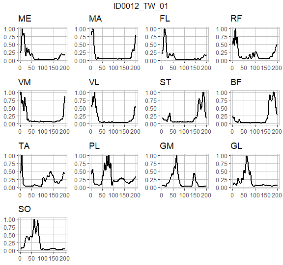
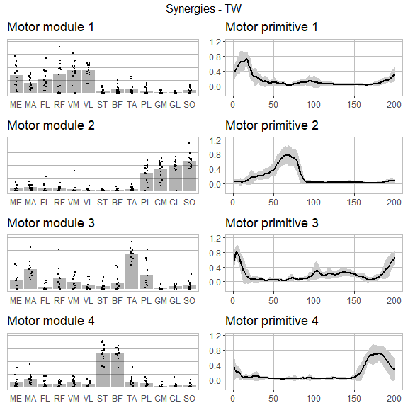
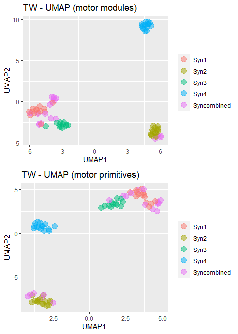
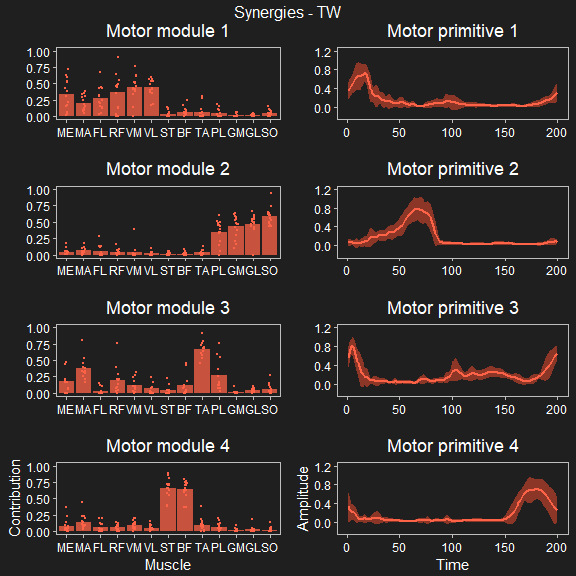
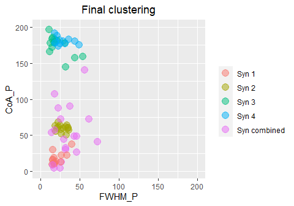
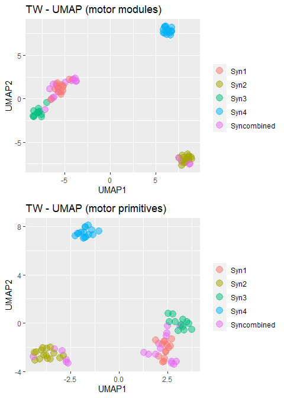
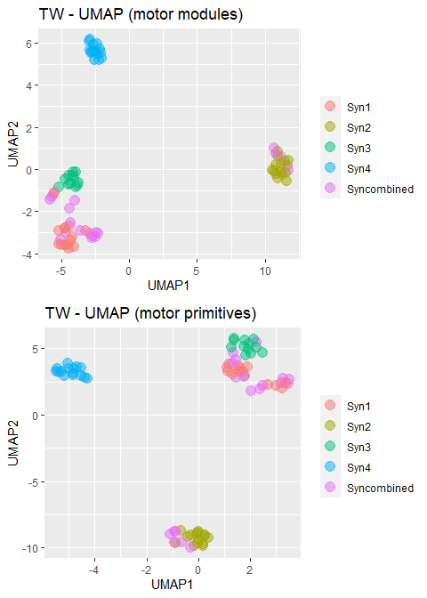
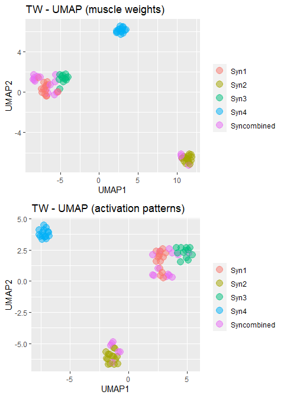

# musclesyneRgies


The package `musclesyneRgies` allows to extract muscle synergies from electromyographic (EMG) data through linear decomposition based on unsupervised machine learning. Specifically, here we adopted the non-negative matrix factorization (NMF) framework, due to the non-negative nature of EMG biosignals. However, this method can be applied to any other kind of data sets, from time series to images.

## Installation
- [Download R](https://cran.r-project.org/mirrors.html) and install (please have R >= `3.5.0`)
- [Download RStudio](https://www.rstudio.com/products/rstudio/download/) and install
- Open RStudio and install the package `devtools` with `install.packages("devtools")`
- Load `devtools` with `library(devtools)`
- Install the package `musclesyneRgies` with `install_github("alesantuz/musclesyneRgies")`.

Done! Now the package is installed on your computer.

## What this package does:
- Help you to prepare the raw data sets in the correct format
- Filter and normalise raw EMG
- Extract muscle synergies
- Classify the extracted muscle synergies
- Analyse muscle synergies with linear and nonlinear metrics
- Plot any data set involved in the process
- All the above tweakable, but with sensible defaults.

## What this package does not do:
- Run the statistics for you
- All that is not specified in the list above.

## A simple workflow
The most simplified workflow for synergy extraction could look as follows (please note that the next chunk of code does not refer to real data and is only intended as a mock example to help you write your own scripts).

```r
# The simplest formulation, using the native (R >= `4.1.0`) pipe operator
# Here, the raw data set is already in the correct format and named `RAW_DATA`
SYNS_classified <- lapply(RAW_DATA, filtEMG) |>
  lapply(function(x) normEMG(x, cycle_div = c(100, 100))) |>
  lapply(synsNMF) |>
  classify_kmeans()
```
Compact, isn't it? You can of course tweak and tune all the above to fit your scientific needs and more is explained below and in the [vignettes](https://github.com/alesantuz/musclesyneRgies/tree/master/vignettes).

## How to prepare your data set
The data set must be in a specific format to fit the analysis framework. However, if you worked with versions <= `0.8.7-alpha` you will find that requirements are now much less stringent, to the benefit of usability. What you need (see also `?rawdata`) is a list of objects of class `EMG`, each of which is a list with two elements:

- `cycles` data frame containing cycle timings, with as many columns as many cycle subdivisions are wanted
- `emg` data frame containing raw EMG data in columns, first column must be time in the same units as in the cycle timings.

Here is an example of how those two elements should look like:

```r
library(musclesyneRgies)
data("RAW_DATA")
head(RAW_DATA[[1]]$cycles)
```

```
##      V1    V2
## 1 1.414 2.074
## 2 2.448 3.115
## 3 3.488 4.141
## 4 4.515 5.168
## 5 5.549 6.216
## 6 6.596 7.249
```

```r
head(RAW_DATA[[1]]$emg)
```

```
##     time         ME        MA       FL        RF        VM        VL        ST
## 1  0.014   0.201416 -6.445313 22.65930 -0.100708 -0.906372  7.351685 -1.309204
## 3  0.015  -2.316284 -0.100708 24.16992  1.812744 -1.913452 -4.531860  2.920532
## 5  0.016  -7.351685 -7.150269 23.46497  0.704956 -5.337524  3.424072 -0.604248
## 7  0.017  -5.538940 -3.222656 27.49329  5.236816 -4.330444 -1.611328  0.503540
## 9  0.018 -10.675049 -5.740356 23.16284 -0.704956  2.014160  1.007080 -2.719116
## 11 0.019 -12.487793 -3.927612 19.94019  2.014160 -5.136108 -0.805664  0.000000
##           BF         TA         PL        GM         GL         SO
## 1  -7.351685 -44.311523   2.316284  8.862305  -8.358765   8.963013
## 3  -2.719116 -24.673462  -0.704956 10.070801 -10.775757   1.611328
## 5  -8.963013 -18.630981 -15.408325  8.358765  -0.704956  -5.035400
## 7  -5.941772   0.906372 -11.883545  5.136108  -4.330444 -10.574341
## 9  -3.826904 -25.680542   1.812744 -5.136108  -1.913452  -8.761597
## 11 -3.524780 -43.807983   6.546021 10.574341  -0.100708   0.302124
```

As you might have noticed, column names do not matter for the `cycles` data frame, but they do for `emg`: this is convenient for the subsequent analysis, since you don't want to loose track of which columns refer to which muscle. Also, the first column must always contain time information, in the same format as in the `cycles` data frame (preferably in seconds).

If you feel like this is too convoluted or you prefer to work directly with ASCII files such as tab-separated txt or comma-separated csv, you can proceed as follows:

- Put your cycle-timings and raw emg ASCII files in two separate folders; please note that the file names **must** be the same (ideally containing the trial codes but this is up to you)
- Run the function `rawdata` which will ask you where your files are and will build the R list in the correct format for you.

Here is an example of how to use the function `rawdata`, no data is needed since the code uses the package's built-in data set to create ASCII files that will then be re-imported through the function:


```r
# Load the package
library(musclesyneRgies)

# Load built-in data set
data("RAW_DATA")

# Get current working directory
data_path <- getwd()
data_path <- paste0(data_path, .Platform$file.sep)

# Create two conveniently-named subfolders if they don't already exist
# (if they exist, please make sure they're empty!)
dir.create("cycles", showWarnings = FALSE)
dir.create("emg", showWarnings = FALSE)

# Export ASCII data from built-in data set to the new subfolders
write.table(RAW_DATA[[1]]$cycles,
  file = paste0(data_path, "cycles", .Platform$file.sep, names(RAW_DATA)[1], ".txt"),
  sep = "\t", row.names = FALSE
)
write.table(RAW_DATA[[1]]$emg,
  file = paste0(data_path, "emg", .Platform$file.sep, names(RAW_DATA)[1], ".txt"),
  sep = "\t", row.names = FALSE
)

# Run the function to parse ASCII files into objects of class `EMG`
raw_data_from_files <- rawdata(
  path_cycles = paste0(data_path, "/cycles/"),
  path_emg = paste0(data_path, "/emg/"),
  header_cycles = FALSE
)

# Check data in the new folders if needed before running the following (will delete!)

# Delete folders
unlink("cycles", recursive = TRUE)
unlink("emg", recursive = TRUE)
```

## Workflow example
All the code in this section will work as in the example if you copy and paste it in R or RStudio.

```r
# Load the package
library(musclesyneRgies)

# Load the built-in example data set
data("RAW_DATA")

# Say you recorded more cycles than those you want to consider for the analysis
# You can subset the raw data (here we keep only 3 cycles, starting from the first)
RAW_DATA_subset <- pbapply::pblapply(
  RAW_DATA,
  function(x) {
    subsetEMG(x,
      cy_max = 3,
      cy_start = 1
    )
  }
)

# Raw EMG can be plotted with the following (the first three seconds are plot by default)
# Now also in dark mode if you fancy it
pp <- plot_rawEMG(RAW_DATA[[1]],
  trial = names(RAW_DATA)[1],
  row_number = 4,
  col_number = 4,
  dark_mode = TRUE,
  line_col = "tomato3"
)
```

<!-- -->

```r
# The raw EMG data set then needs to be filtered
# If you don't want to subset the data set, just filter it as it is
# Here we filter the whole data set with the default parameters for locomotion:
# - Demean EMG
# - High-pass IIR Butterworth 4th order filter (cut-off frequency 50 Hz)
# - Full-wave rectification (default)
# - Low-pass IIR Butterworth 4th order filter (cut-off frequency 20 Hz)
# - Minimum subtraction
# - Amplitude normalisation
filtered_EMG <- pbapply::pblapply(RAW_DATA, function(x) filtEMG(x))

# If you decide to change filtering parameters, just give them as arguments:
another_filtered_EMG <- pbapply::pblapply(
  RAW_DATA,
  function(x) {
    filtEMG(x,
      demean = FALSE,
      rectif = "halfwave",
      HPf = 30,
      HPo = 2,
      LPf = 10,
      LPo = 2,
      min_sub = FALSE,
      ampl_norm = FALSE
    )
  }
)

# Now the filtered EMG needs some time normalisation so that cycles will be comparable
# Here we time-normalise the filtered EMG, including only three cycles and trimming first
# and last to remove unwanted filtering effects
# Each cycle is divided into two parts, each normalised to a length of 100 points
norm_EMG <- pbapply::pblapply(
  filtered_EMG,
  function(x) {
    normEMG(x,
      trim = TRUE,
      cy_max = 3,
      cycle_div = c(100, 100)
    )
  }
)

# If this cycle division does not work for you, it can be changed
# But please remember to have the same amount of columns in the cycle times as the number
# of phases you want your cycles to be divided into
# Here we divide each cycle with a ratio of 60%-40% and keep only two cycles (first and last
# are still trimmed, so to have two cycles you must start with at least four available)
another_norm_EMG <- pbapply::pblapply(
  filtered_EMG,
  function(x) {
    normEMG(x,
      trim = TRUE,
      cy_max = 2,
      cycle_div = c(120, 80)
    )
  }
)

# The filtered and time-normalised EMG can be plotted with the following
pp <- plot_meanEMG(norm_EMG[[1]],
  trial = names(norm_EMG)[1],
  row_number = 4,
  col_number = 4,
  dark_mode = TRUE,
  line_size = 0.8,
  line_col = "tomato3"
)
```

<!-- -->

```r
# At this stage, synergies can be extracted
# This is the core function to extract synergies via NMF
SYNS <- pbapply::pblapply(norm_EMG, synsNMF)

# The extracted synergies can be plotted with the following
pp <- plot_syn_trials(SYNS[[1]],
  max_syns = max(unlist(lapply(SYNS, function(x) x$syns))),
  trial = names(SYNS)[1],
  dark_mode = TRUE,
  line_size = 0.8,
  line_col = "tomato1",
  sd_col = "tomato4"
)
```

<!-- -->

```r
# Now synergies don't have a functional order and need classification
# Let's load the built-in data set to have some more trial to classify
# (clustering cannot be done on only one trial and having just a few,
# say less than 10, won't help)
data("SYNS")

# Classify with k-means and produce a plot that shows how the clustering went with:
# - Full width at half maximum on the x-axis
# - Centre of activity on the y-axis
# (both referred to the motor primitives of the classified muscle synergies)
SYNS_classified <- classify_kmeans(SYNS,
  interactive = FALSE
)
```

<!-- --><!-- -->

```r
# Classified synergies can be finally plotted with
pp <- plot_classified_syns(SYNS_classified,
  dark_mode = TRUE,
  line_col = "tomato1",
  sd_col = "tomato4",
  condition = "TW"
) # "TW" = Treadmill Walking, change with your own
```

<!-- -->

```r
# A 2D UMAP plot of the classified synergies can be obtained with
pp <- plot_classified_syns_UMAP(SYNS_classified,
  condition = "TW"
)
```

<!-- -->

```r
# From now on, it's all about the analysis
# For example, one can measure the full width at half maximum (FWHM)
# of the motor primitives or their centre of activity (CoA)
# Load a typical motor primitive of 30 cycles (from locomotion)
data("primitive")

# Reduce primitive to the first cycle
prim_sub <- primitive$signal[1:which(primitive$time == max(primitive$time))[1]]

# Calculate FWHM of the first cycle
prim_sub_FWHM <- FWHM(prim_sub)
# Calculate CoA of the first cycle
prim_sub_CoA <- CoA(prim_sub)

# Half maximum (for the plots)
hm <- min(prim_sub) + (max(prim_sub) - min(prim_sub)) / 2
hm_plot <- prim_sub
hm_plot[which(hm_plot > hm)] <- hm
hm_plot[which(hm_plot < hm)] <- NA

# Plots
plot(prim_sub, ty = "l", xlab = "Time", ylab = "Amplitude")
lines(hm_plot, lwd = 3, col = 2) # FWHM (horizontal, in red)
graphics::abline(v = prim_sub_CoA, lwd = 3, col = 4) # Coa (vertical, in blue)
```

<!-- -->

```r
# Or perhaps one might want to investigate the nonlinear behaviour of a long primitive
prim <- primitive$signal

# Calculate the local complexity or Higuchi's fractal dimension (HFD)
nonlin_HFD <- HFD(prim)$Higuchi
# Calculate the local complexity or Hurst exponent (H)
nonlin_H <- Hurst(prim, min_win = max(primitive$time))$Hurst

message("Higuchi's fractal dimension: ", round(nonlin_HFD, 3))
```

```
## Higuchi's fractal dimension: 1.047
```

```r
message("Hurst exponent: ", round(nonlin_H, 3))
```

```
## Hurst exponent: 0.338
```
