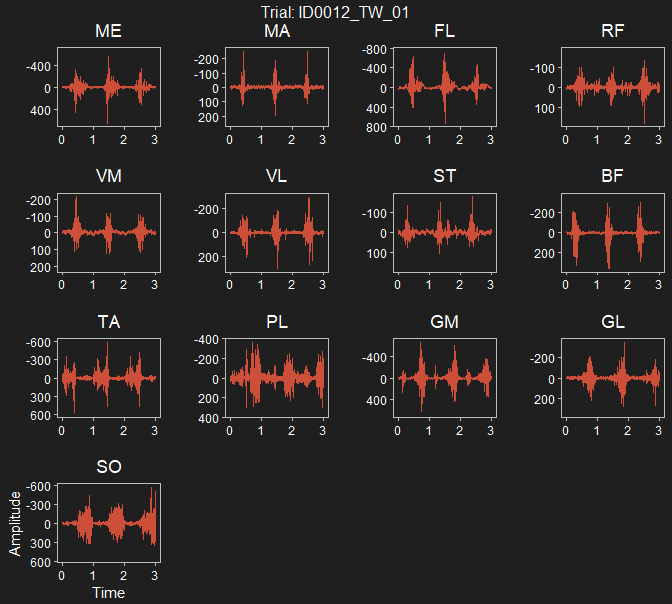
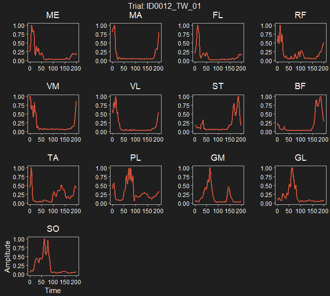
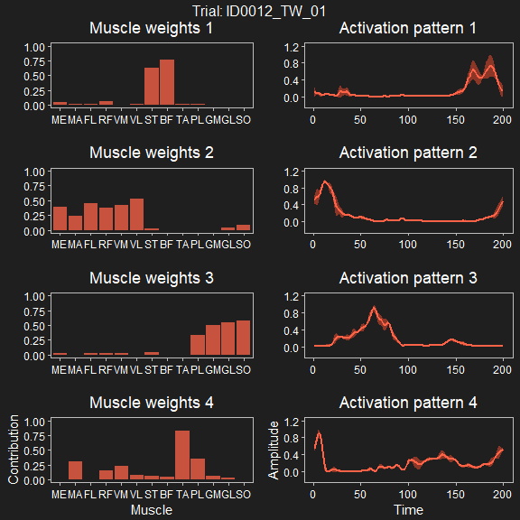
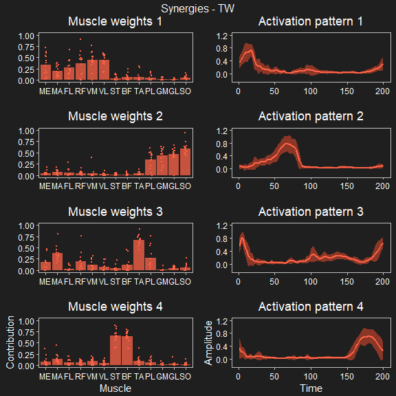
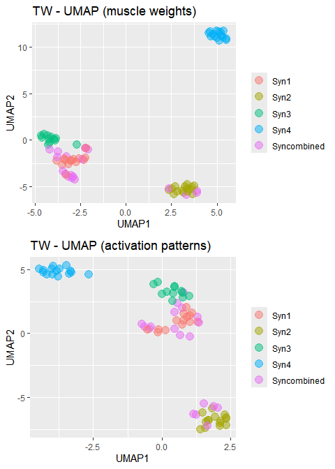
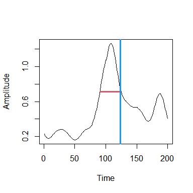

[](https://doi.org/10.21105/joss.04439)
[](https://bsky.app/profile/musclesynergies.bsky.social)

# musclesyneRgies


The `musclesyneRgies` package enables the extraction of muscle synergies from electromyographic (EMG) data via a linear decomposition approach based on unsupervised machine learning. Specifically, we adopted the non-negative matrix factorisation (NMF) framework due to the non-negative nature of EMG biosignals. However, this method can be applied to any kind of dataset, from time series to images.
Muscle synergies are orchestrated activations of functionally similar muscle groups. This theory stems from the work of the neurophysiologist Nikolai Bernstein, who suggested that the central nervous system might use such a strategy to simplify the production and control of movement. Rather than commanding each muscle individually to execute a particular task, the central nervous system may send common (but individually weighted) commands to several muscles simultaneously. This idea can be modelled using linear decomposition algorithms such as NMF. The output consists of two sets: one of time-independent coefficients (also called muscle weights), and one of time-dependent coefficients (also called activation patterns).
If you use this R package, please cite [Santuz, 2022](https://joss.theoj.org/papers/10.21105/joss.04439).

## Installation
- [Download R](https://cran.r-project.org/mirrors.html) and install (please have R >= `4.1.0`)
- [Download RStudio](https://docs.posit.co/ide/user/#rstudio-ide-oss-downloads) and install
- Open RStudio and install the package with `install.packages("musclesyneRgies")`.

Done! The package is now installed on your computer.

## What this package does:
- helps you prepare raw data sets in the correct format
- filters and normalises raw EMG
- extract muscle synergies
- classifies the extracted muscle synergies
- analyse muscle synergies using linear and nonlinear metrics
- plot any dataset involved in the process.
All of the above can be tweaked, but sensible defaults are provided, which are particularly useful for locomotion datasets.

## What this package does not do:
- run the statistics for you
- anything not specified in the list above.

## A simple workflow
The simplest workflow for synergy extraction could look as follows. Please note that the next chunk of code does not refer to real data and is only intended to help you write your own scripts.

``` r
# The simplest formulation, using the native (R >= `4.1.0`) pipe operator
# Here, the raw data set is already in the correct format and named `RAW_DATA`
SYNS_classified <- lapply(RAW_DATA, filtEMG) |>
  lapply(function(x) normEMG(x, cycle_div = c(100, 100))) |>
  lapply(synsNMF) |>
  classify_kmeans()
```
You can, of course, tweak and tune all of the above to suit your scientific requirements, and further information can be found below and in the [vignettes](https://github.com/alesantuz/musclesyneRgies/tree/master/vignettes).
To try out the above code with real data, you can download the test dataset from Zenodo:

``` r
# Download test data set containing EMG from human locomotion
url <- "https://zenodo.org/record/6645483/files/RAW_DATA.RData"
download.file(url, destfile = "RAW_DATA.RData", mode = "wb")
# Load test data set
load("RAW_DATA.RData")
# Subset data to allow for correct classification (TW = treadmill walking, TR = treadmill running)
RAW_DATA <- RAW_DATA[grep("_TW_", names(RAW_DATA))]
```

## How to prepare your dataset
Your dataset must be in a specific format to fit the analysis framework. However, if you have worked with versions <= `0.8.7-alpha`, you will find that the requirements are now much less stringent for the sake of usability. What you need (see also `?rawdata`) is a list of objects of class 'EMG', each of which is a list containing two elements:

- a 'cycles' data frame containing cycle timings with as many columns as there are cycle subdivisions
- an 'emg' data frame containing raw EMG data in columns; the first column must contain time in the same units as the cycle timings.

Here is an example of what these two elements should look like:

``` r
library(musclesyneRgies)
data("RAW_DATA")
head(RAW_DATA[[1]]$cycles)
```

```
##      V1    V2
## 1 1.414 2.074
## 2 2.448 3.115
## 3 3.488 4.141
## 4 4.515 5.168
## 5 5.549 6.216
## 6 6.596 7.249
```

``` r
head(RAW_DATA[[1]]$emg)
```

```
##    time         ME        MA       FL        RF        VM        VL        ST
## 1 0.014   0.201416 -6.445313 22.65930 -0.100708 -0.906372  7.351685 -1.309204
## 2 0.015  -2.316284 -0.100708 24.16992  1.812744 -1.913452 -4.531860  2.920532
## 3 0.016  -7.351685 -7.150269 23.46497  0.704956 -5.337524  3.424072 -0.604248
## 4 0.017  -5.538940 -3.222656 27.49329  5.236816 -4.330444 -1.611328  0.503540
## 5 0.018 -10.675049 -5.740356 23.16284 -0.704956  2.014160  1.007080 -2.719116
## 6 0.019 -12.487793 -3.927612 19.94019  2.014160 -5.136108 -0.805664  0.000000
##          BF         TA         PL        GM         GL         SO
## 1 -7.351685 -44.311523   2.316284  8.862305  -8.358765   8.963013
## 2 -2.719116 -24.673462  -0.704956 10.070801 -10.775757   1.611328
## 3 -8.963013 -18.630981 -15.408325  8.358765  -0.704956  -5.035400
## 4 -5.941772   0.906372 -11.883545  5.136108  -4.330444 -10.574341
## 5 -3.826904 -25.680542   1.812744 -5.136108  -1.913452  -8.761597
## 6 -3.524780 -43.807983   6.546021 10.574341  -0.100708   0.302124
```


In this example, cycle times are recorded as foot touchdown times (first column) and lift-off times (second column), as the dataset describes locomotion. As you may have noticed, the order of the column names does not matter for the 'cycles' data frame, but it does matter for 'emg': this is useful for subsequent analysis, as it helps to avoid confusion over which columns refer to which muscle. Also, the first column must always contain time information in the same format as in the 'cycles' data frame (ideally in seconds).

If you find this too complicated or would prefer to work directly with ASCII files, such as tab-separated TXT or comma-separated CSV, you can proceed as follows:

- put your cycle timings and raw EMG ASCII files in two separate folders; please note that the file names **must** be the same (ideally containing the trial codes, but this is up to you)
- run the function 'rawdata', which will prompt you for the location of your files and build the R list in the correct format.

Below is an example of how to use the function 'rawdata'. No data is required, as the code uses the package's built-in dataset to create ASCII files that will then be reimported through the function.

``` r
# Load the package
library(musclesyneRgies)

# Load built-in data set
data("RAW_DATA")

# Get current working directory
data_path <- getwd()
data_path <- paste0(data_path, .Platform$file.sep)

# Create two conveniently-named subfolders if they don't already exist
# (if they exist, please make sure they're empty!)
dir.create("cycles", showWarnings = FALSE)
dir.create("emg", showWarnings = FALSE)

# Export ASCII data from built-in data set to the new subfolders
write.table(RAW_DATA[[1]]$cycles,
  file = paste0(data_path, "cycles", .Platform$file.sep, names(RAW_DATA)[1], ".txt"),
  sep = "\t", row.names = FALSE
)
write.table(RAW_DATA[[1]]$emg,
  file = paste0(data_path, "emg", .Platform$file.sep, names(RAW_DATA)[1], ".txt"),
  sep = "\t", row.names = FALSE
)

# Run the function to parse ASCII files into objects of class `EMG`
raw_data_from_files <- rawdata(
  path_cycles = paste0(data_path, "/cycles/"),
  path_emg = paste0(data_path, "/emg/"),
  header_cycles = FALSE
)

# Check data in the new folders if needed before running the following (will delete!)

# Delete folders
unlink("cycles", recursive = TRUE)
unlink("emg", recursive = TRUE)
```

## Workflow example
All the code in this section will work as in the example if you copy and paste it in R or RStudio.

``` r
# Load the package
library(musclesyneRgies)

# Load the built-in example data set
data("RAW_DATA")

# Say you recorded more cycles than those you want to consider for the analysis
# You can subset the raw data (here we keep only 3 cycles, starting from the first)
RAW_DATA_subset <- lapply(
  RAW_DATA,
  function(x) {
    subsetEMG(x,
      cy_max = 3,
      cy_start = 1
    )
  }
)

# Raw EMG can be plotted with the following (the first three seconds are plot by default)
# Now also in dark mode if you fancy it
pp <- plot_rawEMG(RAW_DATA[[1]],
  trial = names(RAW_DATA)[1],
  row_number = 4,
  col_number = 4,
  dark_mode = TRUE,
  line_col = "tomato3"
)
```

```
## Warning: Using `size` aesthetic for lines was deprecated in ggplot2 3.4.0.
## ℹ Please use `linewidth` instead.
## ℹ The deprecated feature was likely used in the musclesyneRgies package.
##   Please report the issue at
##   <https://github.com/alesantuz/musclesyneRgies/issues>.
## This warning is displayed once per session.
## Call `lifecycle::last_lifecycle_warnings()` to see where this warning was
## generated.
```

<!-- -->

``` r
# The raw EMG data set then needs to be filtered
# If you don't want to subset the data set, just filter it as it is
# Here we filter the whole data set with the default parameters for locomotion:
# - Demean EMG
# - High-pass IIR Butterworth 4th order filter (cut-off frequency 50 Hz)
# - Full-wave rectification (default)
# - Low-pass IIR Butterworth 4th order filter (cut-off frequency 20 Hz)
# - Minimum subtraction
# - Amplitude normalisation
filtered_EMG <- lapply(RAW_DATA, function(x) filtEMG(x))

# If you decide to change filtering parameters, just give them as arguments:
another_filtered_EMG <- lapply(
  RAW_DATA,
  function(x) {
    filtEMG(x,
      demean = FALSE,
      rectif = "halfwave",
      HPf = 30,
      HPo = 2,
      LPf = 10,
      LPo = 2,
      min_sub = FALSE,
      ampl_norm = FALSE
    )
  }
)

# Now the filtered EMG needs some time normalisation so that cycles will be comparable
# Here we time-normalise the filtered EMG, including only three cycles and trimming first
# and last to remove unwanted filtering effects
# Each cycle is divided into two parts, each normalised to a length of 100 points
norm_EMG <- lapply(
  filtered_EMG,
  function(x) {
    normEMG(x,
      trim = TRUE,
      cy_max = 3,
      cycle_div = c(100, 100)
    )
  }
)

# If this cycle division does not work for you, it can be changed
# But please remember to have the same amount of columns in the cycle times as the number
# of phases you want your cycles to be divided into
# Here we divide each cycle with a ratio of 60%-40% and keep only two cycles (first and last
# are still trimmed, so to have two cycles you must start with at least four available)
another_norm_EMG <- lapply(
  filtered_EMG,
  function(x) {
    normEMG(x,
      trim = TRUE,
      cy_max = 2,
      cycle_div = c(120, 80)
    )
  }
)

# The filtered and time-normalised EMG can be plotted with the following
pp <- plot_meanEMG(
  norm_EMG[[1]],
  trial = names(norm_EMG)[1],
  row_number = 4,
  col_number = 4,
  dark_mode = TRUE,
  line_size = 0.8,
  line_col = "tomato3"
)
```

<!-- -->

``` r
# At this stage, synergies can be extracted
# This is the core function to extract synergies via NMF
SYNS <- lapply(norm_EMG, synsNMF)

# The extracted synergies can be plotted with the following
pp <- plot_syn_trials(
  SYNS[[1]],
  max_syns = max(unlist(lapply(SYNS, function(x) x$syns))),
  trial = names(SYNS)[1],
  dark_mode = TRUE,
  line_size = 0.8,
  line_col = "tomato1",
  sd_col = "tomato4"
)
```

<!-- -->

``` r
# Now synergies don't have a functional order and need classification
# Let's load the built-in data set to have some more trial to classify
# (clustering cannot be done on only one trial and having just a few,
# say less than 10, won't help)
data("SYNS")

# Classify with k-means and produce a plot that shows how the clustering went with:
# - Full width at half maximum on the x-axis
# - Centre of activity on the y-axis
# (both referred to the activation patterns of the classified muscle synergies)
SYNS_classified <- classify_kmeans(SYNS)
```

``` r
# Classified synergies can be finally plotted with
pp <- plot_classified_syns(
  SYNS_classified,
  dark_mode = TRUE,
  line_col = "tomato1",
  sd_col = "tomato4",
  condition = "TW"
) # "TW" = Treadmill Walking, change with your own
```

<!-- -->

``` r
# A 2D UMAP plot of the classified synergies can be obtained with
pp <- plot_classified_syns_UMAP(
  SYNS_classified,
  condition = "TW"
)
```

<!-- -->

``` r
# From now on, it's all about the analysis
# For example, one can measure the full width at half maximum (FWHM)
# of the activation patterns or their centre of activity (CoA)
# Load a typical activation pattern of 30 cycles (from locomotion)
data("act_pattern")

# Reduce activation pattern to the first cycle
act_sub <- act_pattern$signal[1:which(act_pattern$time == max(act_pattern$time))[1]]

# Calculate FWHM of the first cycle
act_sub_FWHM <- FWHM(act_sub)
# Calculate CoA of the first cycle
act_sub_CoA <- CoA(act_sub)

# Half maximum (for the plots)
hm <- min(act_sub) + (max(act_sub) - min(act_sub)) / 2
hm_plot <- act_sub
hm_plot[which(hm_plot > hm)] <- hm
hm_plot[which(hm_plot < hm)] <- NA

# Plots
plot(act_sub, ty = "l", xlab = "Time", ylab = "Amplitude")
lines(hm_plot, lwd = 3, col = 2) # FWHM (horizontal, in red)
graphics::abline(v = act_sub_CoA, lwd = 3, col = 4) # CoA (vertical, in blue)
```

<!-- -->

``` r
# Or perhaps one might want to investigate the nonlinear behaviour of a long activation pattern
act <- act_pattern$signal

# Calculate the local complexity or Higuchi's fractal dimension (HFD)
nonlin_HFD <- HFD(act)$Higuchi
# Calculate the global complexity or Hurst exponent (H)
nonlin_H <- Hurst(act, min_win = max(act_pattern$time))$Hurst

message("Higuchi's fractal dimension: ", round(nonlin_HFD, 3))
```

```
## Higuchi's fractal dimension: 1.047
```

``` r
message("Hurst exponent: ", round(nonlin_H, 3))
```

```
## Hurst exponent: 0.338
```
## How to contribute to `musclesyneRgies`
Thank you for taking the time to read this. Please refer to the [CONTRIBUTING](https://github.com/alesantuz/musclesyneRgies/blob/master/CONTRIBUTING.md) section for guidance on contributing to this package.

<!-- badges: start -->
[](https://github.com/alesantuz/musclesyneRgies/actions/workflows/R-CMD-check.yaml)
<!-- badges: end -->
